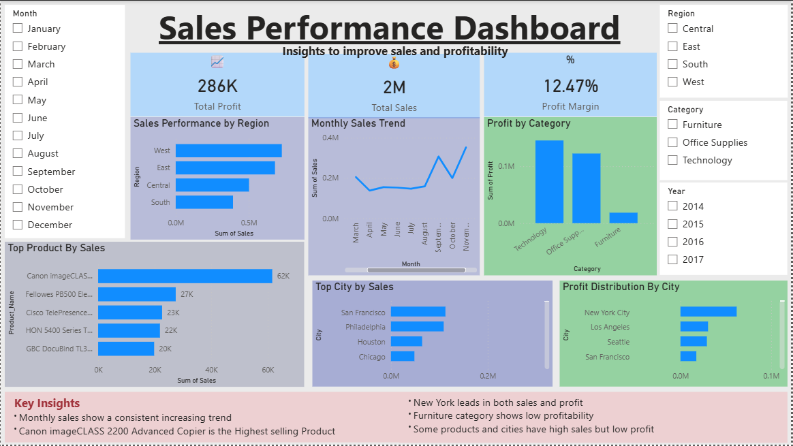

📊 Sales Performance Dashboard

📌 Objective

The objective of this project is to analyze sales data and identify key insights to improve business performance and profitability.

---

🛠 Tools Used

* Power BI
* SQL
* Excel

---

🔄 Process

1. Collected and cleaned the dataset using Excel
2. Performed data analysis using SQL
3. Created KPIs like Total Sales, Total Profit, and Profit Margin
4. Built an interactive dashboard using Power BI
5. Generated insights and business recommendations

---

📈 Key Insights

* West region generates the highest sales
* Technology category is the most profitable
* Furniture category shows low profitability
* Sales trend is increasing over time
* Some cities have high sales but low profit

---

💡 Business Recommendations

* Focus on high-performing regions like West
* Improve cost efficiency in low-profit categories
* Promote top-selling products
* Optimize pricing and logistics in low-profit cities

---

📷 Dashboard Preview

